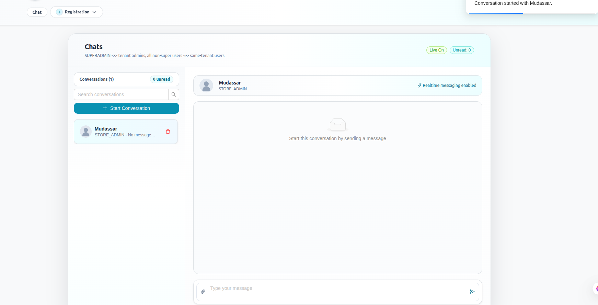
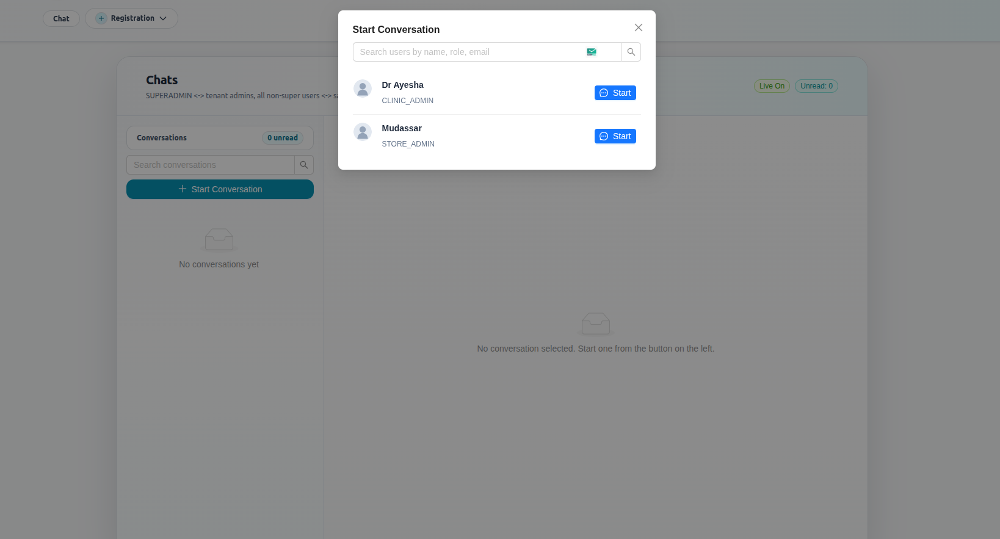
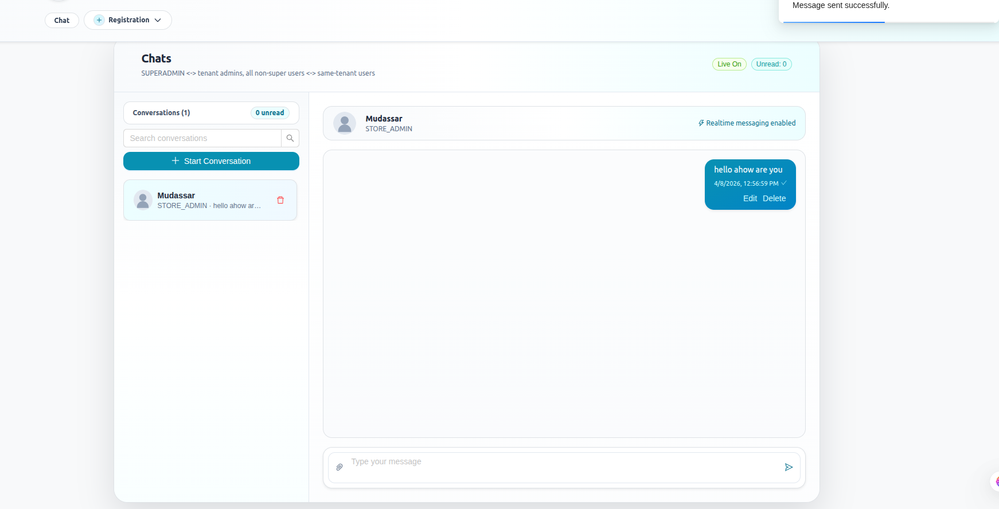
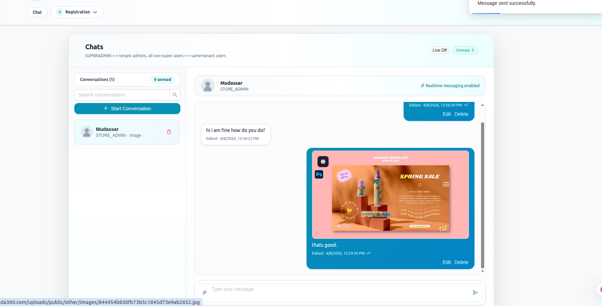

# Permission-Based Chat System

Role-aware, real-time chat platform with strict communication governance.

This repository is built to answer one core problem:

How do we keep chat fast and modern while enforcing who is allowed to communicate, who can approve access, and who can audit activity?

## Overview

Permission-Based Chat System is a full-stack monorepo with:
- Backend: Express, Prisma, PostgreSQL, Socket.IO
- Frontend: React, TypeScript, Vite

The system supports private and group messaging, cross-group permission workflows, two-factor authentication, session controls, and security auditability.

## Showcase highlights

- Real-time messaging with delivery/read states
- Role hierarchy (`user`, `admin`, `superadmin`)
- Cross-group private messaging gated by admin approval
- Session-aware JWT auth with refresh flow
- Optional 2FA with challenge/verify flow
- One-time private messages (auto-consume behavior)
- Attachment and avatar uploads with persisted file metadata
- Admin tools: blocked IPs, audit logs, session control
- Modular backend architecture and typed frontend client


## Chat screenshots

The screenshots below are sourced from `frontend/public` and include chat module views only.

### Conversations panel

Shows the left-side conversation list, unread indicators, and active conversation area.



### Start conversation flow

Displays the user picker modal used to start a new private conversation.



### Text messaging

Demonstrates a successful text message send with message actions.



### Media or document message in chat

Shows a chat message containing uploaded media/document content.



### Reply view (receiver side)

Shows how replies and message flow appear from the other participant perspective.


### Reply view (sender side)

Shows the corresponding sender-side message layout in the same conversation.


## Architecture

```text
Frontend (React + Vite)
  -> REST API (/api/*)
  -> Socket.IO events

Backend (Express + Socket.IO)
  -> Prisma ORM
  -> PostgreSQL
  -> Redis (cache/support)
  -> File storage (backend/public/uploads)
```

## Role and visibility model

### Role scope

| Role | Can use chat | Can manage groups | Can approve/reject permissions | Can manage admins | Can view security tools |
|---|---|---|---|---|---|
| user | Yes | No | No | No | No |
| admin | Yes | Yes | Yes | No | Yes |
| superadmin | Yes | Yes | Yes | Yes | Yes |

### Who can see which messages

| Conversation type | Condition | Who can see content |
|---|---|---|
| Private | Same-group users | Sender + receiver |
| Private | Different-group users without approved permission | Blocked |
| Private | Different-group users with approved chat permission | Sender + receiver |
| Group | User is member of group | Group members |
| One-time private | Receiver has opened message once | Message is consumed and content cleared |

### Data ownership and privacy behavior

- Users can access their own profile, notifications, and personal chat history in allowed conversations.
- Group messages are limited to current group membership.
- Cross-group private messaging requires approved `ChatPermission` when policy demands it.
- Session status (`active`, `revoked`, `blocked`, `expired`) is enforced server-side.

## Feature map

### Authentication and account security

- Register, login, refresh-token, logout
- Access + refresh token strategy
- Session-bound access control with revocation support
- Optional 2FA for login and account protection
- Avatar upload and profile update

### Messaging and collaboration

- Private messaging
- Group messaging
- Typing indicators
- Reply-to-message
- Read/delivery status updates
- One-time message consumption flow
- Edit window and scoped delete behaviors

### Access governance

- Permission request creation and review
- Admin approve/reject with optional remarks and expiration
- Direct permission grant/revoke by admins
- Role-based route protection across modules

### Administrative controls

- Group lifecycle management
- Group member management and ownership transfer
- Session monitoring and block/unblock actions
- Blocked IP list management
- Audit log visibility

## Repository structure

```text
Permission-Based-Chat-System/
  backend/
    prisma/
    src/
      config/
      controllers/
      middlewares/
      routes/
      services/
      sockets/
      utils/
    tests/
  frontend/
    src/
      api/
      components/
      hooks/
      types/
      utils/
  package.json
```

## Tech stack

### Backend

- Node.js
- Express.js
- PostgreSQL
- Prisma ORM
- Socket.IO
- JWT
- Redis
- Multer
- express-validator

### Frontend

- React 18
- TypeScript
- Vite
- Axios
- Ant Design
- Tailwind CSS
- Socket.IO Client

## Getting started

### 1. Prerequisites

- Node.js 18+
- npm
- PostgreSQL
- Redis (recommended)

### 2. Install dependencies

From repository root:

```bash
npm run install:all
```

### 3. Configure environment

Create `backend/.env` using your own secure values.

Minimum required:

```env
NODE_ENV=development
PORT=3000
DATABASE_URL=postgresql://postgres:<password>@localhost:5432/permission-based-chat-system-backend?schema=public

JWT_ACCESS_SECRET=<strong_secret>
JWT_REFRESH_SECRET=<strong_secret>
JWT_ACCESS_EXPIRES_IN=12h
JWT_REFRESH_EXPIRES_IN=7d

CORS_ORIGIN=http://localhost:5173
REDIS_URL=redis://127.0.0.1:6379/0
```

Optional but useful:

```env
TWO_FACTOR_WEBHOOK_URL=
TWO_FACTOR_ALLOW_DEBUG_RESPONSE=false
CACHE_TTL_SECONDS=300
```

Important:
- Do not commit real credentials or secrets.
- Replace default seeded passwords before production deployment.
- `JWT_SECRET` is supported as fallback for split secrets.

### 4. Prepare database

From `backend/`:

```bash
npx prisma db push --accept-data-loss
npx prisma generate
npm run seed:admin
```

### 5. Start the app

From repository root:

```bash
npm run dev
```

Expected local endpoints:
- Frontend: `http://localhost:5173`
- Backend API: `http://localhost:3000/api`
- Health check: `GET /api/health`

## Available scripts

### Root

| Command | Description |
|---|---|
| npm run install:all | Install backend + frontend dependencies |
| npm run dev | Run backend and frontend together |
| npm run build | Build frontend |
| npm run verify | Backend tests + frontend build |
| npm run test | Backend tests |

### Backend

| Command | Description |
|---|---|
| npm run dev | Run backend with nodemon |
| npm run start | Run backend with node |
| npm run test | Run backend tests |
| npm run test:cache | Run cache-focused tests |
| npm run seed:admin | Seed default admin/superadmin/users |
| npm run format | Format backend files |

### Frontend

| Command | Description |
|---|---|
| npm run dev | Start Vite dev server |
| npm run build | Type-check and build |
| npm run lint | Run ESLint |
| npm run preview | Preview built app |

## API module index

Base path: `/api`

### Auth
- `POST /auth/register`
- `POST /auth/login`
- `POST /auth/admin/login`
- `POST /auth/refresh-token`
- `POST /auth/logout`
- `GET /auth/me`
- `POST /auth/2fa/login/verify`
- `POST /auth/2fa/enable`
- `POST /auth/2fa/enable/verify`
- `POST /auth/2fa/disable`
- `GET /auth/sessions`
- `DELETE /auth/sessions/:sessionId`

### Users
- `GET /users`
- `GET /users/search?q=`
- `GET /users/:id`
- `PUT /users/:id`
- `POST /users/me/avatar`
- `PATCH /users/:id/status`

### Groups
- `GET /groups/my`
- `POST /groups/:id/leave`
- `POST /groups`
- `GET /groups`
- `GET /groups/:id`
- `PUT /groups/:id`
- `DELETE /groups/:id`
- `POST /groups/:id/add-members`
- `POST /groups/:id/remove-members`
- `PATCH /groups/:id/transfer-ownership`

### Permissions
- `POST /permissions/request`
- `GET /permissions`
- `GET /permissions/:id`
- `PATCH /permissions/:id/approve`
- `PATCH /permissions/:id/reject`
- `POST /permissions/direct-grant`
- `PATCH /permissions/chat/:permissionId/revoke`
- `GET /permissions/chat-permissions`

### Messages
- `POST /messages/upload`
- `POST /messages/private`
- `POST /messages/group`
- `GET /messages/private/:userId`
- `GET /messages/group/:groupId`
- `GET /messages/search?q=`
- `PATCH /messages/:id/read`
- `PATCH /messages/:id`
- `DELETE /messages/:id`

### Notifications
- `GET /notifications`
- `PATCH /notifications/:id/read`

### Admin and superadmin
- `GET /admin/dashboard`
- `GET /admin/admins`
- `POST /admin/admins`
- `POST /admin/users/:id/promote`
- `PATCH /admin/admins/:id`
- `PATCH /admin/admins/:id/status`
- `POST /admin/admins/:id/demote`
- `GET /admin/sessions`
- `PATCH /admin/sessions/:sessionId/block`
- `PATCH /admin/sessions/:sessionId/unblock`
- `GET /admin/blocked-ips`
- `POST /admin/blocked-ips`
- `PATCH /admin/blocked-ips/:blockedIpId/unblock`
- `GET /admin/audit-logs`

## Socket.IO event reference

Client -> server:
- `private_message`
- `group_message`
- `typing_start`
- `typing_stop`
- `mark_read`
- `edit_message`
- `delete_message`
- `permission_request_created`
- `permission_request_updated`

Server -> client:
- `private_message`
- `group_message`
- `message_status_update`
- `message_one_time_consumed`
- `message_edited`
- `message_deleted`
- `typing_start`
- `typing_stop`
- `permission_request_created`
- `permission_request_updated`
- `notification`

## Data model snapshot

Key Prisma models:
- `User`
- `Group`
- `GroupMember`
- `Message`
- `FileAsset`
- `PermissionRequest`
- `ChatPermission`
- `Notification`
- `LoginSession`
- `BlockedIp`
- `AuditLog`
- `TwoFactorChallenge`
- `TwoFactorRecoveryCode`

## Testing and verification

Run project verification from root:

```bash
npm run verify
```

Run backend tests only:

```bash
npm --prefix backend run test
```

## Postman collection

Use the backend collection for API exploration:

- `backend/postman/Permission-Based-Chat-System.postman_collection.json`

## Production readiness checklist

- Replace all JWT and admin credential placeholders.
- Use strict `CORS_ORIGIN` values.
- Disable debug 2FA response in production.
- Rotate and protect secrets via environment manager.
- Use managed PostgreSQL and Redis where possible.
- Add HTTPS and reverse-proxy headers.
- Enable monitoring for auth/session/anomaly events.

## What this project demonstrates

- Full-stack architecture with clear separation of concerns
- Practical RBAC + workflow-driven access governance
- Real-time stateful communication design
- Security-focused backend patterns beyond basic login
- Portfolio-ready implementation of policy-based communication

## License

ISC
