# Backend Module Analysis

This file selects 8 concrete backend modules from the project and presents a simplified intermediate-code view, a control flow graph, and a data dependence graph for each one. The notation is intentionally compact so it can be used as a study or submission draft.

## 1) `src/app.js`

**Role**: application bootstrap, middleware wiring, route registration, server startup, and graceful shutdown.

**Intermediate code**
```text
start
  load env, db, redis, socket, routes
  create express app
  install compression, cors, helmet, logger, parsers
  serve /uploads
  install ip-block and rate-limit middleware
  register health route
  mount auth, user, group, permission, message, notification, admin routes
  install notFound and errorHandler
  if main module:
    connectDB
    try redis.connect
    create httpServer
    create socket server
    listen on env.port
    wait for SIGINT | SIGTERM | uncaughtException | unhandledRejection
    gracefulShutdown
end
```

**Flow graph**
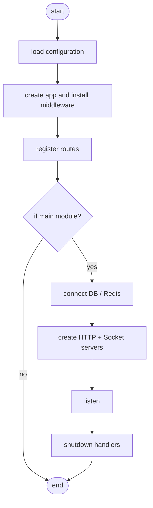

**DD graph**
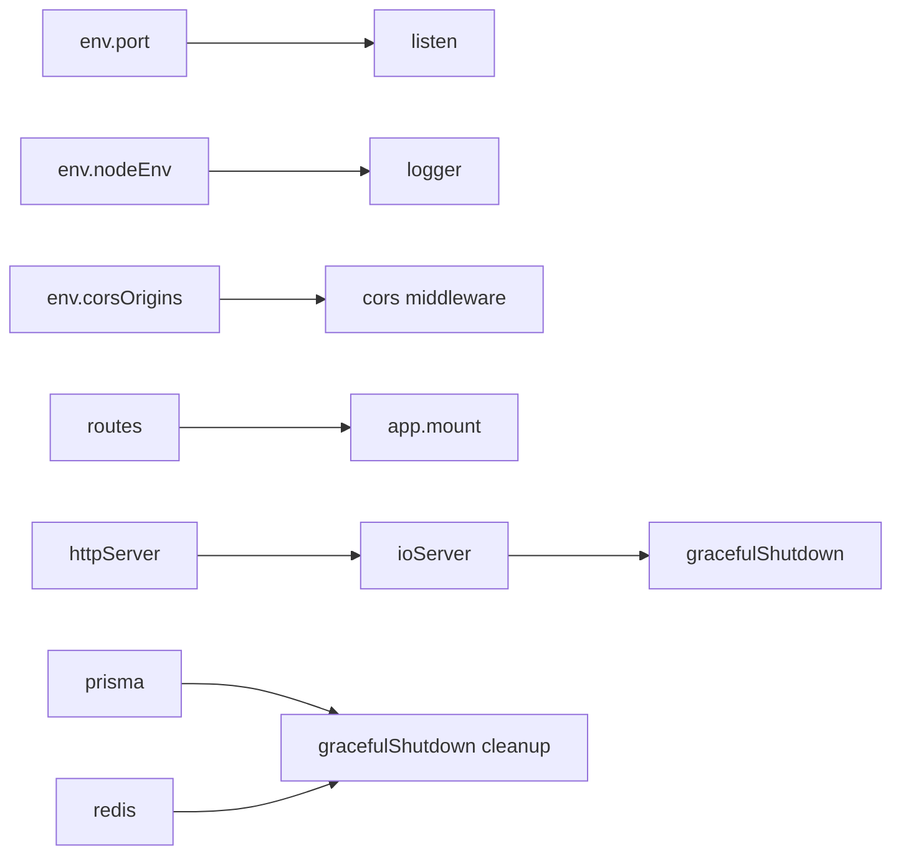

## 2) `src/middlewares/authMiddleware.js`

**Role**: authentication guard that extracts a token, verifies the session, loads the user, and attaches `req.user` and `req.session`.

**Intermediate code**
```text
extract token from Authorization header or cookie
if token missing -> 401 error
decode access token
if sessionId missing -> 401 error
load loginSession with user
if session invalid -> 401 error
if session expired -> mark expired and fail
if session blocked or revoked -> fail
if heartbeat interval elapsed -> update lastSeenAt
if user inactive and role is not elevated -> 403 error
set req.session and req.user
next()
```

**Flow graph**
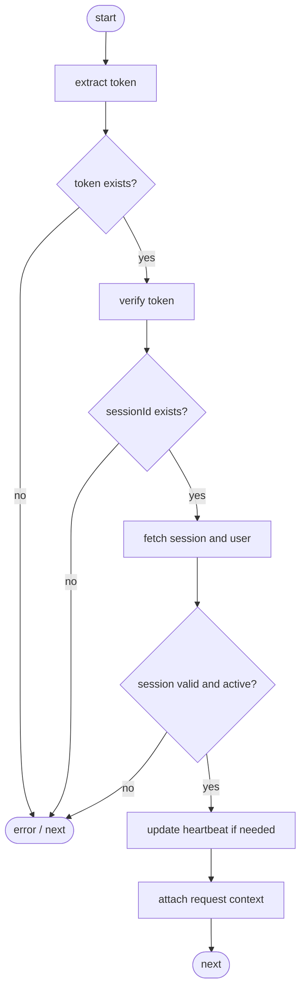

**DD graph**
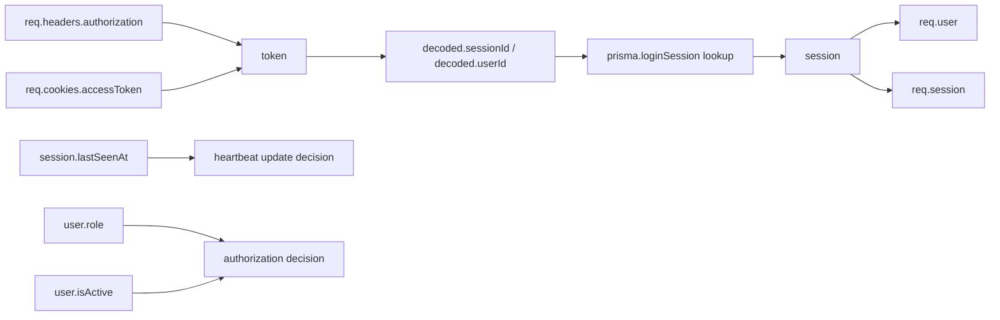

## 3) `src/controllers/authController.js`

**Role**: HTTP layer for login, registration, token refresh, logout, and two-factor actions.

**Intermediate code**
```text
login(req)
  call authService.login(req.body)
  if service says two-factor required
    set login message accordingly
  else
    set success message
  return ApiResponse.success
```

**Flow graph**
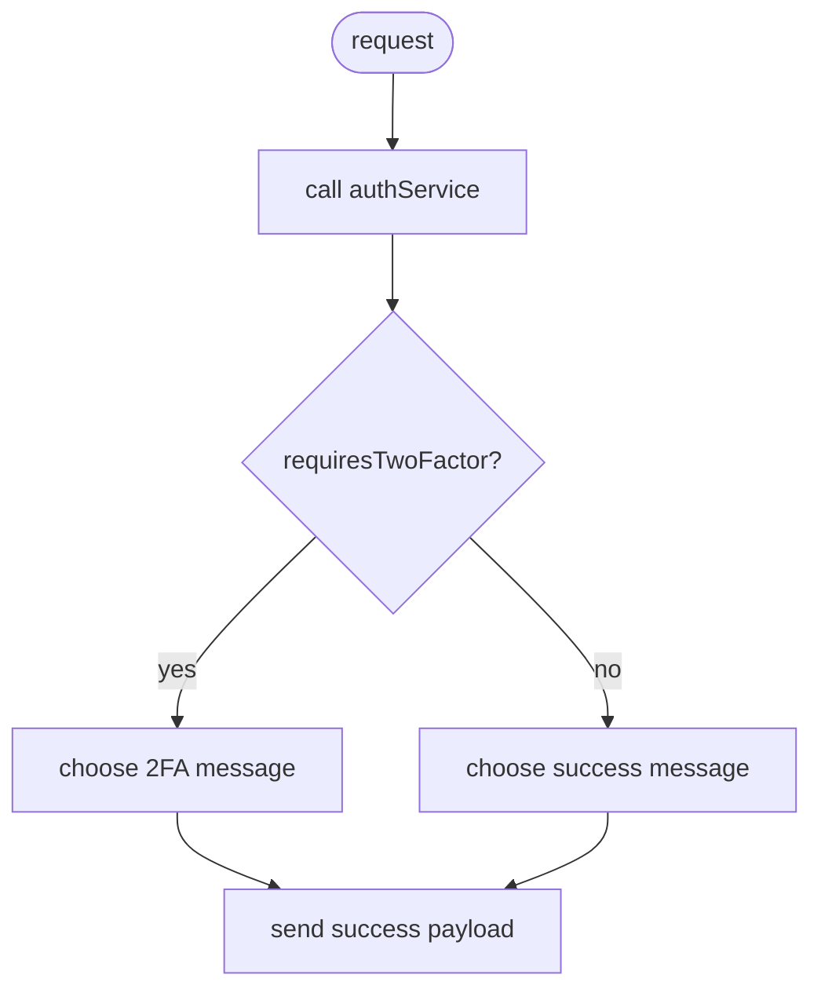

**DD graph**
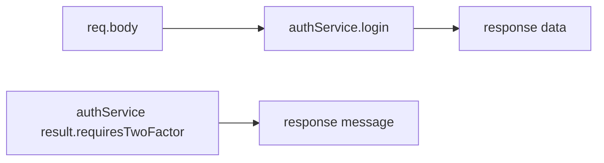

## 4) `src/services/authService.js`

**Role**: authentication core, including password validation, session creation, token issuance, and two-factor challenge handling.

**Intermediate code**
```text
login(email, password, adminOnly, meta)
  normalize email
  find user by email
  if missing -> audit + 401
  compare password
  if invalid -> audit + 401
  if adminOnly and role not admin/superadmin -> audit + 403
  if inactive -> audit + 403
  if two-factor enabled
    create challenge
    audit challenge creation
    return requiresTwoFactor result
  build tokens
  persist refresh token and login session
  audit success
  return user + tokens
```

**Flow graph**
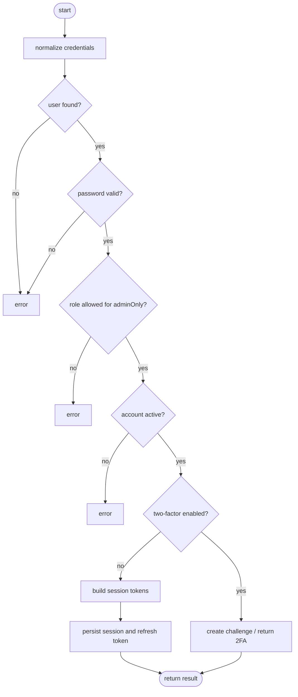

**DD graph**
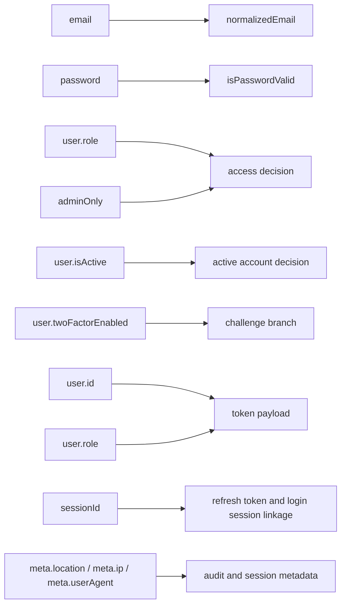

## 5) `src/controllers/messageController.js`

**Role**: HTTP endpoints for sending, browsing, editing, deleting, and uploading message attachments.

**Intermediate code**
```text
sendPrivateMessage(req)
  resolve attachment ids from body
  call messageService.sendPrivateMessage
  return 201 success response
```

**Flow graph**
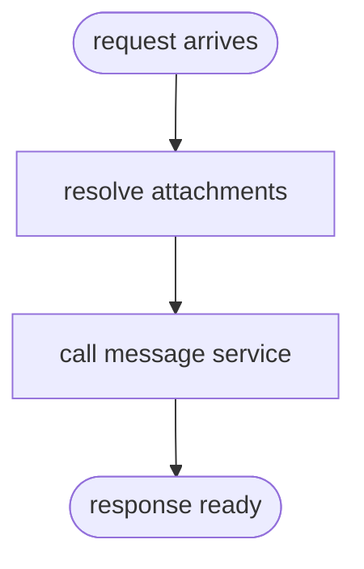

**DD graph**
```mermaid
flowchart LR
  body[req.body.attachmentIds / req.body.attachments] --> ids[attachmentIds]
  user[req.user._id] --> call[service call]
  receiver[req.body.receiverId] --> call
  content[req.body.content] --> call
  call --> response[response data]
```

## 6) `src/services/messageService.js`

**Role**: message rules, permission checks, persistence, socket emission, read status transitions, editing, deletion, history retrieval, and cache invalidation.

**Intermediate code**
```text
sendPrivateMessage(senderId, receiverId, content, attachmentIds, replyToId, oneTime)
  normalize inputs
  reject self messaging
  reject empty message
  ensure both users are active
  check permission to chat privately
  validate reply target
  determine delivered/sent status
  transaction:
    verify attachment ownership
    create message
    attach files to message
  enrich message
  emit private message + status events
  create notification for receiver
  invalidate caches
  return populated message
```

**Flow graph**
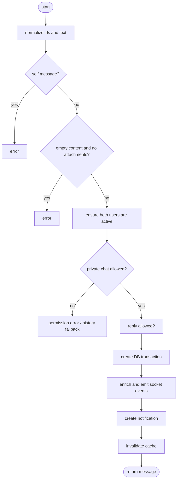

**DD graph**
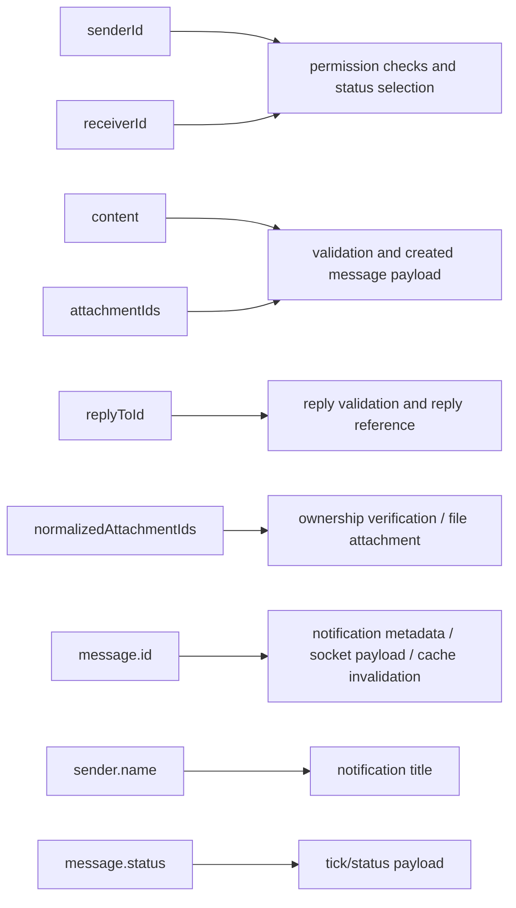

## 7) `src/controllers/groupController.js`

**Role**: group lifecycle, membership management, ownership transfer, and avatar enrichment.

**Intermediate code**
```text
createGroup(req)
  start DB transaction
  create group row
  create owner membership row
  reload group with selected fields
  enrich avatars
  return 201 response
```

**Flow graph**
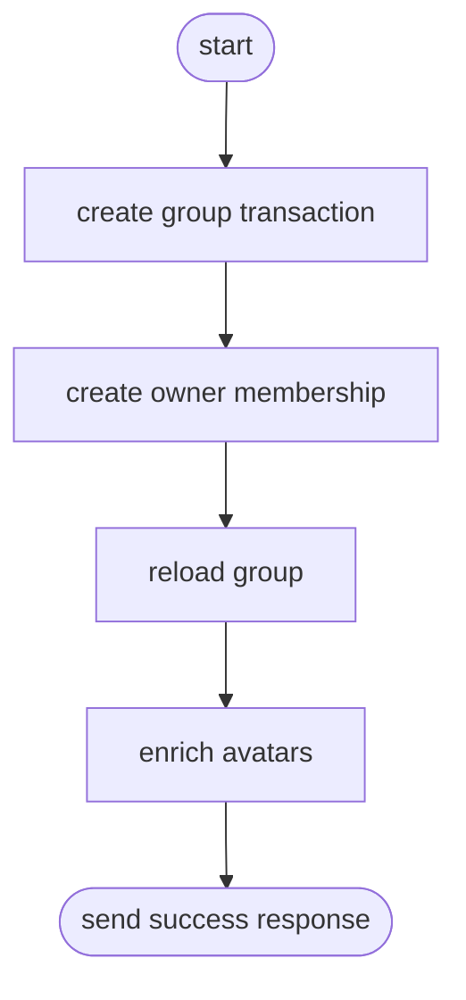

**DD graph**
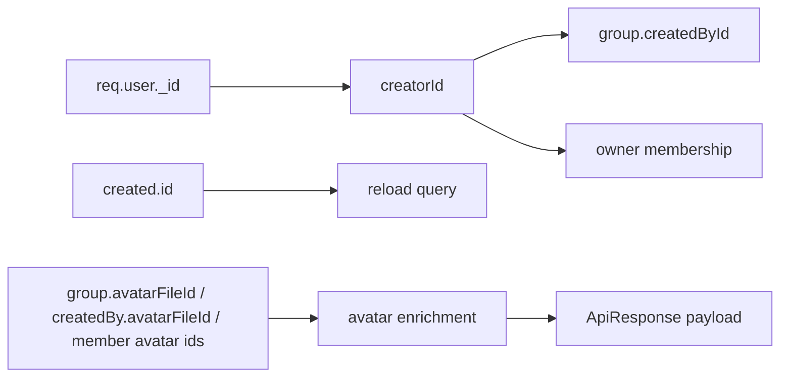

## 8) `src/controllers/notificationController.js`

**Role**: list, read, bulk update, and delete notifications.

**Intermediate code**
```text
listNotifications(req)
  build pagination options from query
  call notificationService.listNotifications
  return items and pagination metadata
```

**Flow graph**
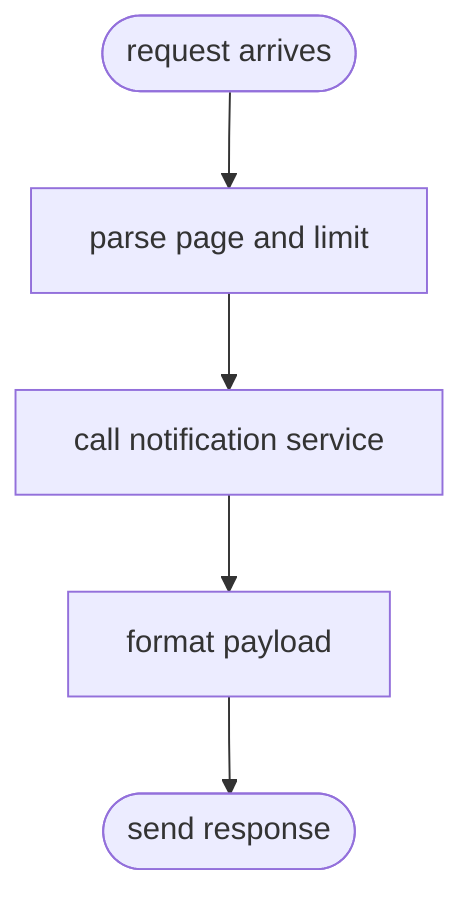

**DD graph**
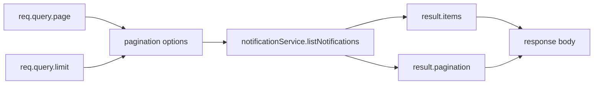

## Notes

- The intermediate code is written as simplified three-address style pseudocode, not compiler output.
- The flow graph is a compact control-flow sketch; the DD graph shows primary data dependencies only.
- If you want, this can be expanded into Mermaid diagrams or a PDF-ready report next.
