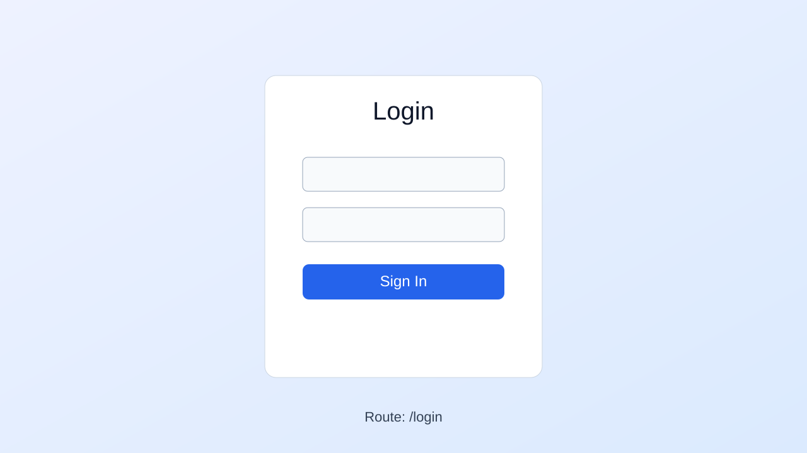
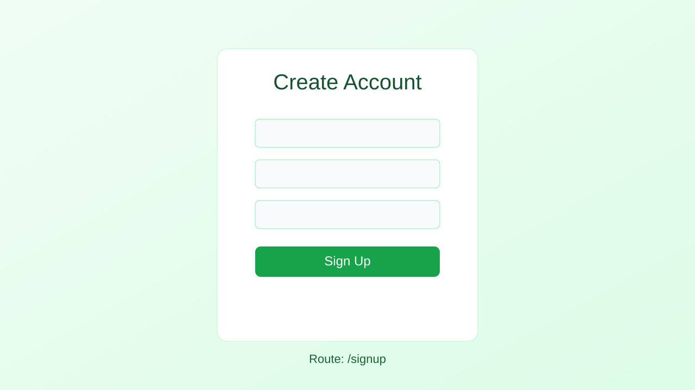
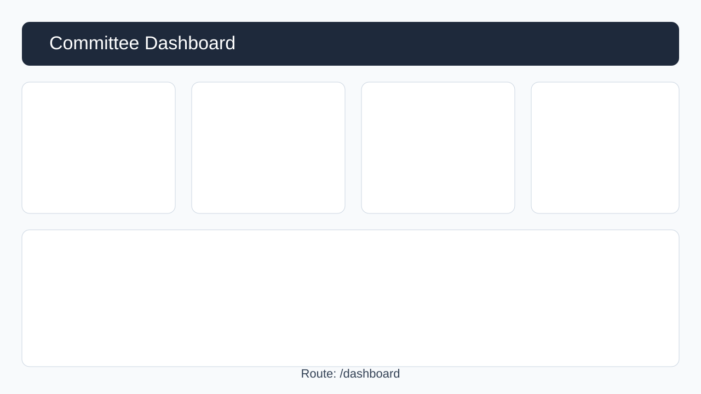
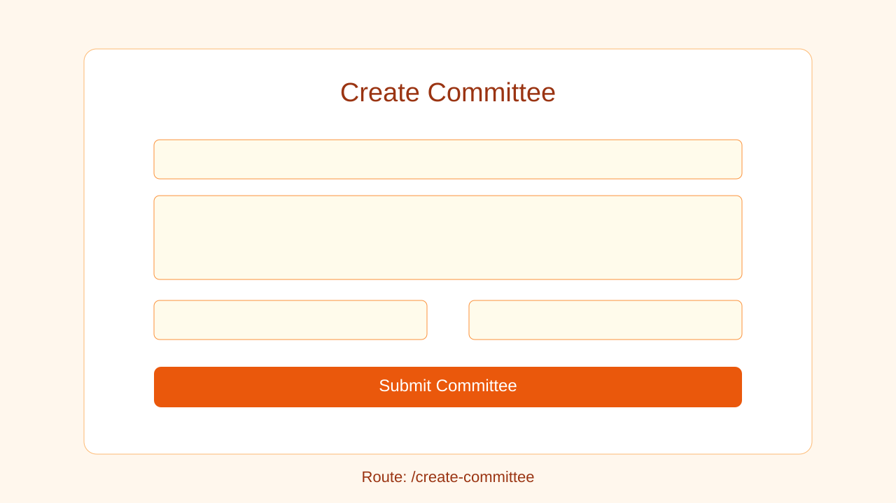
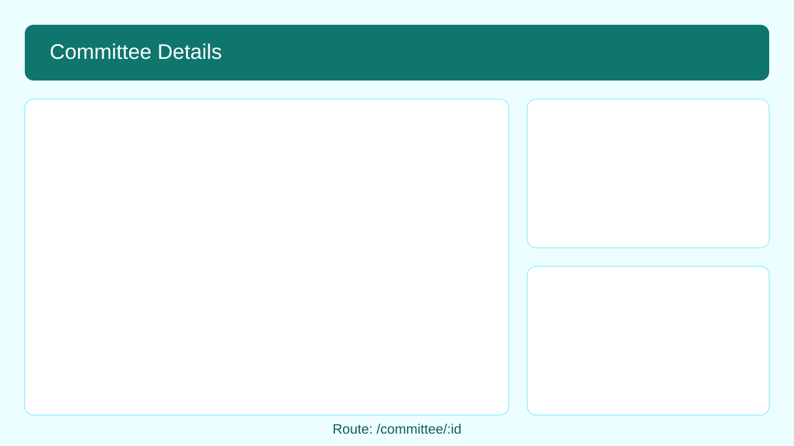
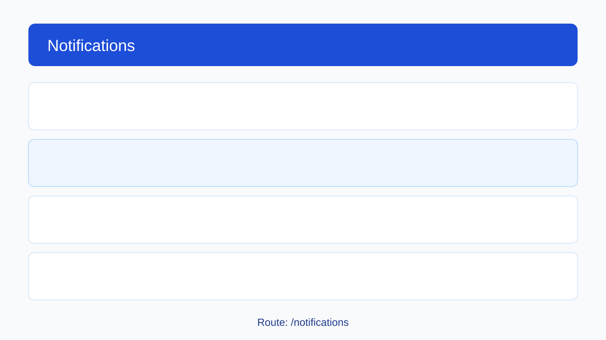

# Committee Management System Documentation

## 1. Overview
The Committee Management System is an Angular + Supabase web application for creating committees, tracking committee activity, and managing user notifications.

## 2. Technology Stack
- Frontend: Angular 21 (standalone components, signals)
- Backend/Data: Supabase (PostgreSQL + Auth + REST API)
- Styling: CSS

## 3. Routes and Features
- `/login`: User authentication (sign in)
- `/signup`: New user registration
- `/dashboard`: Main authenticated landing page
- `/create-committee`: Committee creation form
- `/committee/:id`: Committee detail and activity page
- `/notifications`: Notification list with read-state actions

## 4. Notifications Module (Fixed)
The notifications flow was adjusted to be reliable and production-ready:
- Notifications now load only after auth state is ready.
- Loading and error states are handled explicitly.
- Mark-as-read refresh logic no longer depends on `notifications[0]`.
- Template now uses Angular native control flow consistently (`@if`, `@for`).

### 4.1 Why You See These Browser Console Entries
- `Angular is running in development mode.`
  - This is expected when running `ng serve` or the dev build.
- `...supabase.co/rest/v1/notifications?...`
  - This is the normal network request to fetch user notifications from Supabase.

Both lines are expected in development unless a related HTTP error (4xx/5xx) appears.

## 5. Screen Gallery

### 5.1 Login Screen


### 5.2 Signup Screen


### 5.3 Dashboard Screen


### 5.4 Create Committee Screen


### 5.5 Committee Details Screen


### 5.6 Notifications Screen


## 6. Local Setup
1. Install dependencies:
   ```bash
   npm install
   ```
2. Start development server:
   ```bash
   npm start
   ```
3. Open browser at:
   - `http://localhost:4200`

## 7. Verification Checklist
- Login/Signup flows complete successfully.
- Dashboard opens only for authenticated users.
- Notifications list loads for the signed-in user.
- Mark single notification as read works.
- Mark all notifications as read works.
- "View" action navigates to committee details.

## 8. Notes
- Replace SVG visuals in `docs/screenshots/` with real UI screenshots when preparing final submission/report.
- For production deployment, build using:
  ```bash
  ng build --configuration production
  ```
